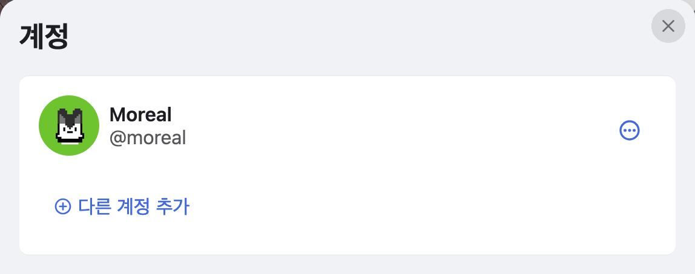
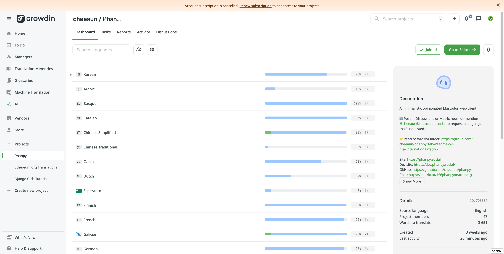
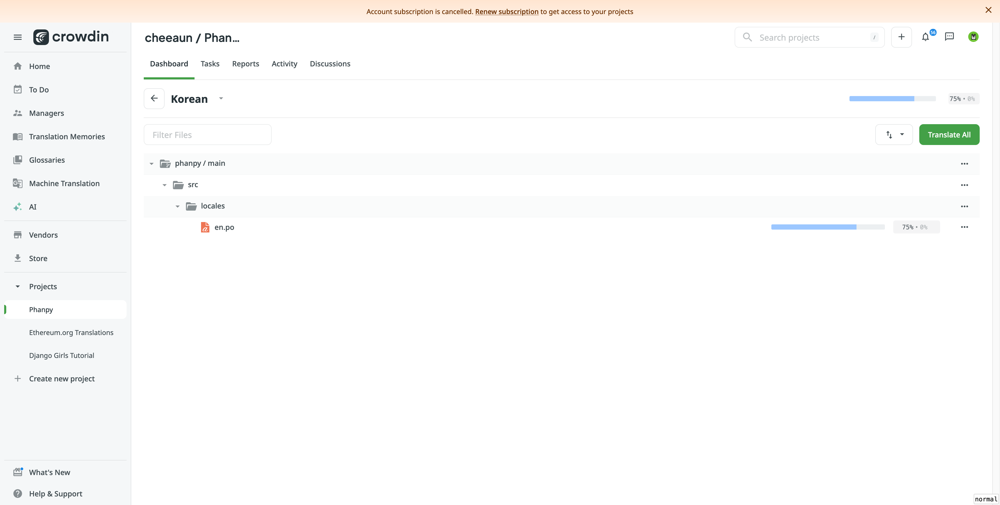
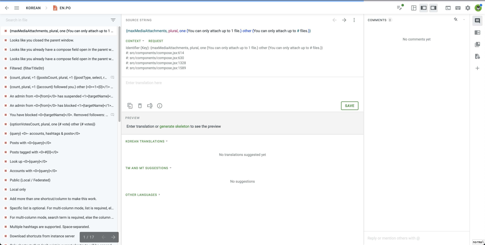
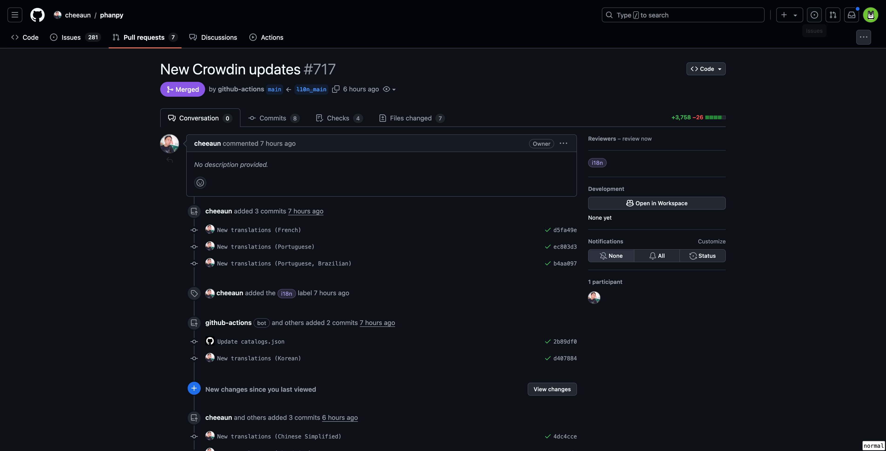
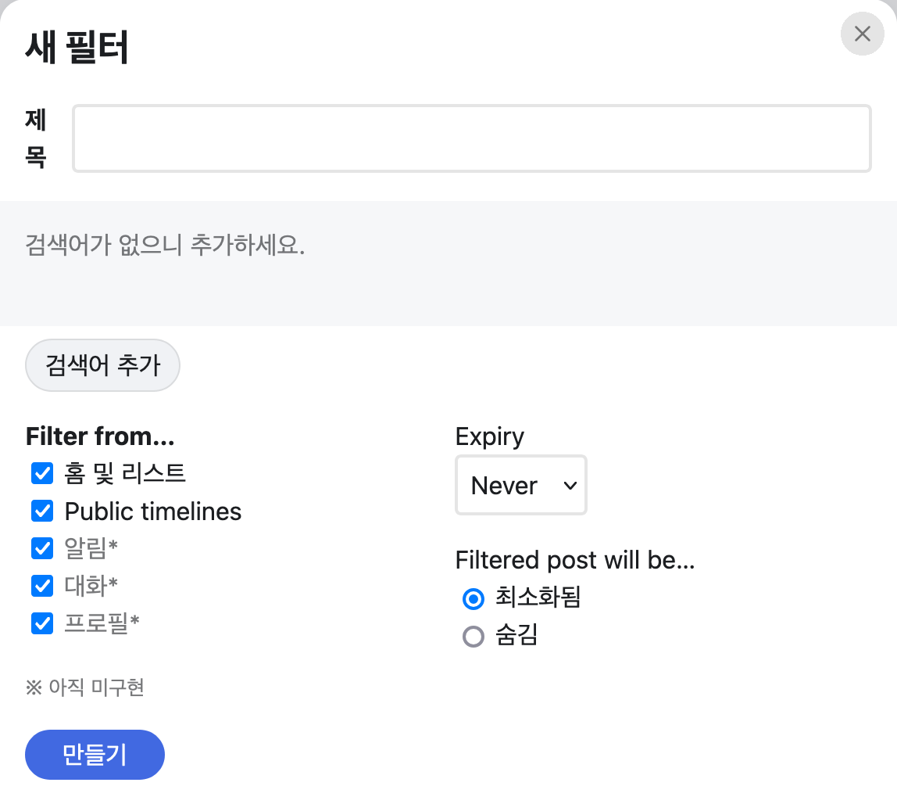
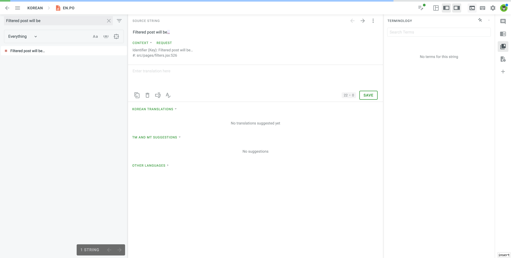
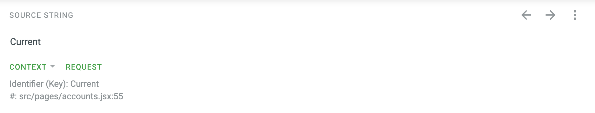
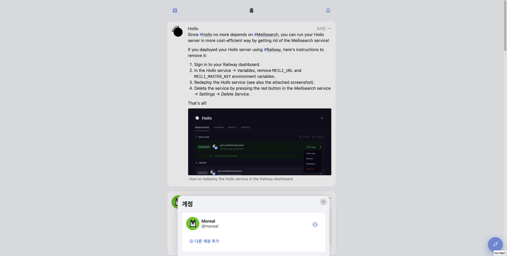

+++
title = "Phanpy 번역 기여하기"
description = "Phanpy에 한국어 번역을 기여한 경험을 기록합니다."
taxonomies.tags = [
    "오픈소스",
    "번역"
]
+++

## 🐘 Phanpy?

[Phanpy](https://github.com/cheeaun/phanpy)는 [cheeaun](https://github.com/cheeaun)이 MIT 라이센스로 만든 미니멀 Mastodon 클라이언트입니다. 원래는 Mastodon 인스턴스에서 제공하는 기본 UI를 사용하다, [FediDev KR](https://fedidev.kr/) 디스코드 서버 "아이디어" 포럼 중 번역 제안을 보고 알게되어 사용 및 번역해보게 되었습니다. 특별한 가입 과정 없이 "Mastodon으로 로그인" 버튼을 눌러 기존에 사용하던 Mastodon 인스턴스 계정을 연결해서 사용할 수 있습니다.


하나의 인스턴스만 연결하는 것이 아닌, 여러 인스턴스의 계정들을 연결해 사용할 수도 있어 보여 다계정의 경우 굉장히 유용할 것 같습니다!



## 🌐 번역

### 번역 시작하기

이 글을 작성하기 3주 전 즈음까지만 해도 다국어 시스템을 지원하지 않았던 것으로 보이나 지금은 [번역 플랫폼인 crowdin을 설정하고](https://github.com/cheeaun/phanpy/issues/183#issuecomment-2039558094) 번역을 받고 있는 걸로 보입니다.

번역에 참여하기 위해서는 우선 [crowdin](https://crowdin.com/)에 가입해주세요. 많은 SSO를 지원하니 편한 로그인 방식으로 회원가입하시면 될 것 같습니다.


그리고 [Phanpy 프로젝트](https://crowdin.com/project/phanpy)에 들어갑니다. 그러면 다양한 언어 중 "Korean" 이 보일텐데 클릭해서 들어가주세요.



`src/locales/en.po` 파일이 보입니다. 클릭해서 들어가시면 번역 가능한 문자열들이 보입니다.





이제 "Enter translation here" 쪽에 알맞은 한국어 문장을 채워넣음으로써 번역에 참여할 수 있게 되었습니다! Crowdin 에서 번역된 내용들은 메인테이너가 Crowdin에서 저장소로 비동기적으로 내용을 동기화를 해주고 있는 것으로 보입니다.



이렇게 main 브랜치에 머지되고 나면 [https://dev.phanpy.social/](https://dev.phanpy.social/) 에서 확인할 수 있습니다!

### Phanpy를 사용하다 미번역된 부분을 발견했을 경우

예를 들어 Phanpy를 사용하다 "Filtered post will be" 라는 문장이 번역되지 않았음을 발견했습니다.



Crowdin에서 "Filtered post will be" 를 검색하면 해당 문장을 찾아줍니다.



"Enter translation here" 에 번역한 문장을 채워넣고 "SAVE" 버튼을 누르시면 번역이 저장됩니다.

### Crowdin을 보고 번역을 하는 경우

저는 FediDev KR 그룹의 번역 제안 글을 보고 Phanpy를 사용 및 번역하게 된 것이기도 하고, 이미 앞서 많이 번역해주셨기 때문에 미번역된 부분을 주로 Crowdin에서 미번역된 부분을 보여주는 기능을 통해 알게 되었습니다. 하지만 정확히 어떤 상황에서 사용되는 문장인지 모르기 때문에 단어 선택 등에 있어 어려움을 겪었습니다.

이때 Crowdin 번역 페이지 중 "Context" 파트를 보면 사용되는 소스코드를 볼 수 있어 도움이 됩니다. 문장을 번역하는 과정을 통해 어떻게 도움이 되는지 설명해보겠습니다.



글을 적을 때 기준 "Current" 라는 문장이 미번역 되어 있습니다. 그리고 아래 `src/pages/accounts.jsx:55` 라는 경로와 라인을 알려주는 "Context" 파트가 있습니다. `accounts` 페이지라고 하는 것 같아 "계정들..." 을 눌러봤는데 달리 "Current" 라는 내용은 없습니다 :(



위 Context 에서 알려준 경로로 가서 [소스코드](https://github.com/cheeaun/phanpy/blob/f9e95a947f02e4866f1f6c2c6d8ebebf856c4535/src/pages/accounts.jsx#L55)를 보니 계정이 여러 개 일때 보여주는 아이콘의 대체 메시지로써 사용되는 것 같습니다.

```javascript
{moreThanOneAccount && (
  <span class={`current ${isCurrent ? 'is-current' : ''}`}>
    <Icon icon="check-circle" alt={t`Current`} />
  </span>
)}
```

제 생각에는 "현재 계정" 이 적절한 표현인 것 같아 그렇게 번역하고 저장하였습니다.

이처럼 실제 페이지에서 찾기 어려운 경우에 "Context" 기능은 더욱 도움이 되었습니다.
